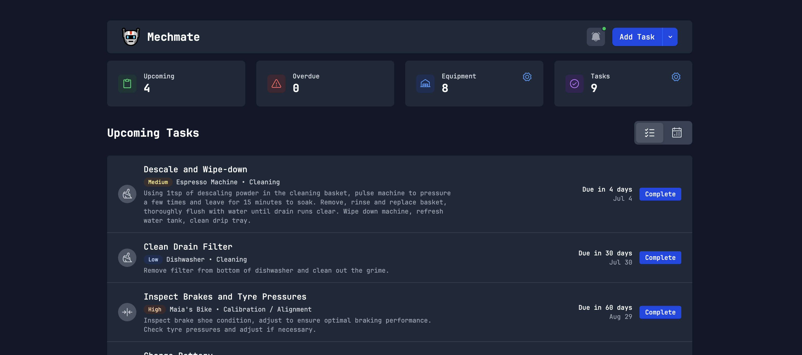

# Mechmate Self-Hosted

A personal maintenance management system for tracking equipment, scheduling maintenance tasks, and managing repair history.



## Features

- **Equipment Management** - Track vehicles, appliances, tools, devices, and mechanical equipment
- **Maintenance Scheduling** - Time-based or usage-based maintenance intervals
- **AI Assistant** - Natural language equipment and task management
- **Maintenance History** - Complete audit trail with cost tracking
- **Push Notifications** - Maintenance reminders (optional)
- **Automatic Backups** - Scheduled database backups with retention
- **Beautiful UI** - Modern, responsive interface built with SvelteKit and Tailwind CSS

## Tech Stack

- **Frontend**: SvelteKit 5 with TypeScript
- **Styling**: Tailwind CSS 4
- **Database**: SQLite with better-sqlite3 and Kysely query builder
- **AI/LLM**: OpenAI API integration with configurable models
- **Notifications**: Web Push API with VAPID
- **Deployment**: Docker with production-ready security

## Quick Start

**Prerequisites:** Docker and Docker Compose installed

```bash
# Clone and deploy
git clone https://github.com/yourusername/mechmate.git
cd mechmate
chmod +x deploy.sh
./deploy.sh
```

Access at `http://localhost:3000`

## Configuration

### Basic Setup

Edit `.env` file to customize:

```bash
# Application
PORT=3000
INSTANCE_NAME="My Mechmate Instance"

# Features (Optional)
OPENAI_API_KEY=your_openai_key_here
VAPID_PUBLIC_KEY=your_vapid_public_key
VAPID_PRIVATE_KEY=your_vapid_private_key
VAPID_SUBJECT=mailto:admin@yourdomain.com

# Security
RATE_LIMIT_ENABLED=true
RATE_LIMIT_MAX_REQUESTS=100
```

### AI Assistant Setup

Mechmate supports any OpenAI-compatible API endpoint:

**OpenAI Direct:**

```bash
OPENAI_API_KEY=your_openai_key_here
OPENAI_MODEL=gpt-4o-mini
```

**OpenRouter (Multiple Providers):**

```bash
OPENAI_API_KEY=your_openrouter_key_here
OPENAI_BASE_URL=https://openrouter.ai/api/v1
OPENAI_MODEL=openai/gpt-4o-mini
```

**Local Models (Ollama/LM Studio):**

```bash
OPENAI_BASE_URL=http://localhost:11434/v1
OPENAI_MODEL=llama3.1:8b
```

### Push Notifications Setup

1. Generate VAPID keys: `npx web-push generate-vapid-keys`
2. Add keys to `.env`
3. Restart: `docker-compose restart mechmate`

## Management

### Daily Operations

```bash
# View logs
docker-compose logs -f mechmate

# Restart service
docker-compose restart mechmate

# Stop service
docker-compose down

# Update to latest version
docker-compose pull && docker-compose up -d
```

### Monitoring

```bash
# Health check
curl http://localhost:3000/health

# System metrics
curl http://localhost:3000/api/system/metrics

# Create manual backup
curl -X POST http://localhost:3000/api/system/backup \
  -H "Content-Type: application/json" \
  -d '{"type": "manual"}'
```

### Data Management

Your data is stored in Docker volumes:

```bash
# List volumes
docker volume ls | grep mechmate

# Backup data volume
docker run --rm -v mechmate_mechmate_data:/data -v $(pwd):/backup ubuntu \
  tar czf /backup/mechmate-data-backup.tar.gz /data

# Restore data volume
docker run --rm -v mechmate_mechmate_data:/data -v $(pwd):/backup ubuntu \
  tar xzf /backup/mechmate-data-backup.tar.gz -C /
```

## Reverse Proxy Setup

### Nginx

```nginx
server {
    listen 80;
    server_name mechmate.yourdomain.com;

    location / {
        proxy_pass http://localhost:3000;
        proxy_set_header Host $host;
        proxy_set_header X-Real-IP $remote_addr;
        proxy_set_header X-Forwarded-For $proxy_add_x_forwarded_for;
        proxy_set_header X-Forwarded-Proto $scheme;
    }
}
```

### Traefik

Add labels to `docker-compose.yml`:

```yaml
services:
  mechmate:
    labels:
      - 'traefik.enable=true'
      - 'traefik.http.routers.mechmate.rule=Host(`mechmate.yourdomain.com`)'
      - 'traefik.http.routers.mechmate.entrypoints=websecure'
      - 'traefik.http.routers.mechmate.tls.certresolver=letsencrypt'
```

## Development

```bash
npm install
npm run dev -- --host
```

Available at `http://localhost:5173`

## Troubleshooting

### Common Issues

**Port already in use:**

```bash
# Change port in .env
PORT=3001

# Or find what's using port 3000
sudo netstat -tulpn | grep 3000
```

**Database issues:**

```bash
# Check database integrity
docker-compose exec mechmate sqlite3 /app/data/mechmate.db "PRAGMA integrity_check;"

# Restore from backup
curl -X POST http://localhost:3000/api/system/backup/restore \
  -H "Content-Type: application/json" \
  -d '{"filename": "your-backup-file.db"}'
```

### Debug Mode

```bash
# Add to .env
LOG_LEVEL=debug
ENABLE_DEBUG_LOGS=true

# Restart and check logs
docker-compose restart mechmate
docker-compose logs -f mechmate
```

## Advanced Configuration

See `DEPLOYMENT.md` for detailed configuration options and `.env.example` for all available settings.

## License

MIT License - see LICENSE file for details.

## Support

- **Documentation**: `DEPLOYMENT.md` for detailed setup
- **Issues**: GitHub issue tracker
- **Health Check**: `http://localhost:3000/health`

---

**Note**: This is a self-hosted application designed for personal use. Ensure proper security measures for production deployments.
