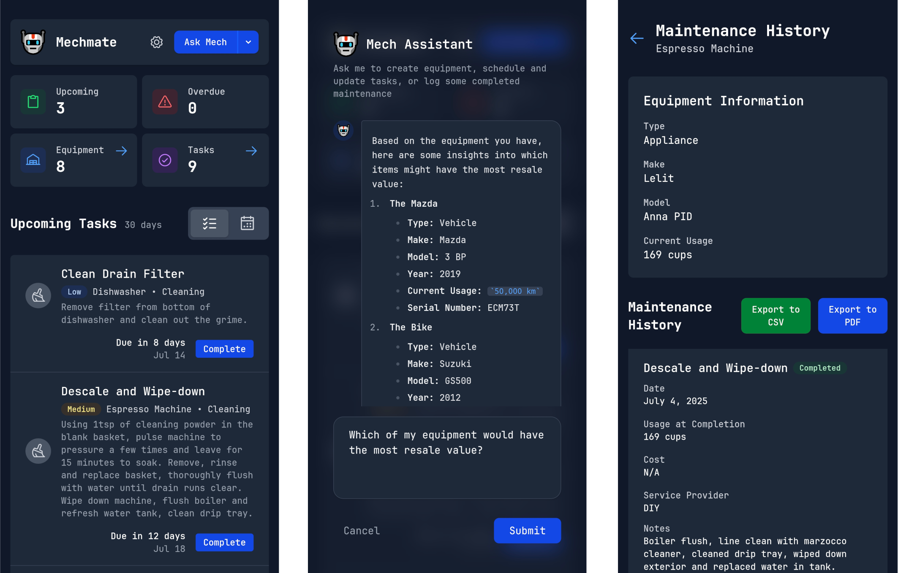

# Mechmate


A personal maintenance scheduler and tracker app for DIY and mechanical enthusiasts. Mechmate provides a simple platform to log different mechanical equipment, configure maintenance schedules, get a personalized dashboard with upcoming maintenance tasks, recieve push notifications about upcoming jobs and export log history of equipment for use in resale or book-keeping.

## Features

- **Equipment Management**: Track vehicles, appliances, tools, devices, and other types of mechanical equipment requiring routine maintenance
- **Flexible Usage Metrics**: Support for different usage types (mileage, hours, cycles, etc.)
- **Dynamic Task Creation**: Create custom maintenance tasks with flexible scheduling
- **Recurring Tasks**: Set up tasks that repeat based on usage or time intervals
- **Maintenance History**: Complete audit trail of all maintenance performed
- **Dashboard Overview**: Personalized view of upcoming and overdue maintenance
- **File Attachments**: Attach invoices, photos, and documentation to maintenance logs
- **Beautiful UI**: Modern, responsive interface built with SvelteKit and Tailwind CSS

## Tech Stack

- **Frontend**: SvelteKit 5 with TypeScript
- **Styling**: Tailwind CSS 4
- **Database**: SQLite with better-sqlite3 and Kysely
- **Deployment**: Docker with nginx reverse proxy
- **SSL**: Automatic HTTPS with Let's Encrypt

## Quick Start

### Prerequisites

- Docker and/or Docker Compose
- Domain name with SSL certificates (notifications will not function in an unsecure browser environment)

### Installation

## With Docker

1. Clone the repository and navigate to the project directory
2. Build and start the application:

```bash
docker build -t mechmate .

docker run -d -p 3000:3000 -v path_to_your_volume_folder:/app/data mechmate
```

3. Access the application at `http://localhost:3000` (or otherwise configured port / domain)

## With Docker Compose

1. Include the following configuration in your docker-compose.yml file:
```yml
mechmate:
    build: ./mechmate
    container_name: mechmate
    volumes:
      - ./mechmate/data:/app/data
    ports:
      - "3000:3000"
    restart: unless-stopped

```
2. Build and run the app with:
```bash
docker compose up -d mechmate
```
3. Access the application at `http://localhost:3000` (or otherwise configured port / domain)


### Development

For local development:

```bash
cd mechmate
npm install
npm run dev -- --host
```

The application will be available at `http://localhost:5173`

## Database Schema

### Equipment
- Basic information (name, type, make, model, year)
- Usage tracking (current value, unit)
- Flexible metadata storage (JSON)
- ~~Tagging support~~ (coming soon)

### Tasks
- Equipment association
- Task type categorization
- Flexible scheduling (usage-based or time-based)
- Priority levels and status tracking

### Maintenance Logs
- Completion tracking with metadata
- Cost and parts tracking
- ~~File attachment support~~ (coming soon)
- Service provider information

## API Endpoints

### Equipment
- `GET /api/equipment` - List all equipment
- `POST /api/equipment` - Create new equipment
- `GET /api/equipment/[id]` - Get equipment details
- `PUT /api/equipment/[id]` - Update equipment
- `DELETE /api/equipment/[id]` - Delete equipment

### Equipment Types
- `GET /api/equipment-types` - List predefined equipment types
- `POST /api/equipment-types` - Create a new equipment type


### Tasks
- `GET /api/tasks` - List all tasks
- `GET /api/tasks?type=upcoming` - Get upcoming tasks
- `GET /api/tasks?type=overdue` - Get overdue tasks
- `POST /api/tasks` - Create new task
- `POST /api/tasks/complete` - Mark a task complete and generate a log entry

### Task Types
- `GET /api/task-types` - List predefined task types

### Dashboard
- `GET /api/dashboard` - Get dashboard statistics

## Configuration

The application defined a few environment variables in the Dockerfile for configuration:

- `NODE_ENV`: Environment (development/production)
- `ORIGIN`: Application origin domain

## Data Persistence

The SQLite database directory is mounted as a volume at `/app/data/`. If a file doesn't already exist in the mounted directory, it will be created on first run of the app server.

## License

This project is licensed under the GPLv3 License - see the LICENSE file for details.

## Support

For issues and feature requests, please use the GitHub issue tracker.
